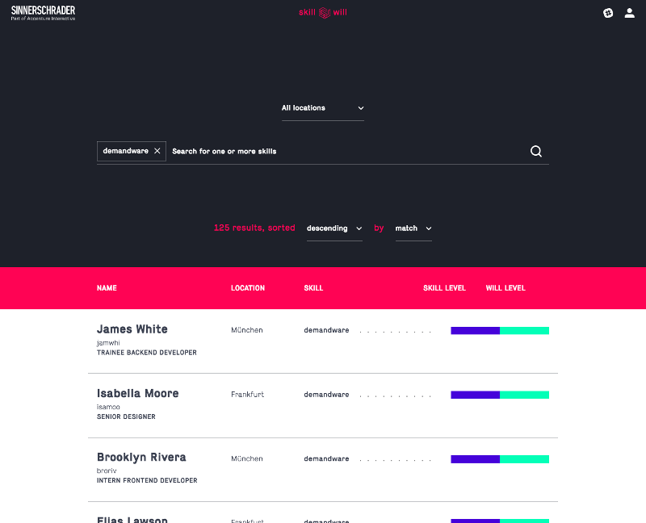

[](https://travis-ci.org/sinnerschrader/SkillWill)
[](https://opensource.org/licenses/mit-license.php)
[](https://sinnerschrader.com/)


# What exactly is SkillWill?



SkillWill is SinnerSchrader's internal tool to track what people know (their skills) and what people want to do (their wills).
Every employee can define their personal levels of interest and knowledge for each skill in the system; anyone can search for persons by those skills, e.g.
* You want somebody to teach you programming language x? → Search for x and see who can help.
* You're a project manager and need somebody who can do x? → Search x foobar and you get a list of candidates.
* You want to get better at x? → Show your interest for x and people who need some to do x will find you.
* ...

SkillWill creates more transparency about the collective knowledge and needs at SinnerSchrader and provides insights about our employees' skills that might not have been revealed. It encourages teamwork and and simplifies team planning.


# Development Setup

## Infrastructure
* Java 12
* A local [MongoDB](https://www.mongodb.com/)
  * port defined in application.properties
  * you could embed one, see section 'Build'
* node/npm
  * building with maven uses its own installation, but you'll need it for frontend development
* maven
  * you can use the built-in maven wrapper

## Building
* ```mvn clean install```
* if there isn't any maven installed locally, use the wrapper
 * ```./mvnw clean install```
* if you want to use an embedded mongodb
 * ```mvn clean install -PmongoEmbedded```

## Starting
* building creates a runnable jar file in ```/target```
* start it (e.g. ```java -jar target/skillwill.jar```)

## Frontend Dev Server
* Tired of waiting for maven? There's a dev server for that!
* Have a version of the backend running (local or remote)
* run ```npm run start``` in ```/src/frontend```
* see the fancy webpack development server on port ```8888```
* including hot loading when source changes

## Important URLs
* `/`: Application main view
* `/swagger-ui.html`: Interactive API documentation
* `/actuator/info`: Show application-specific stats (# of users, skills per user, etc.)
* `/actuator/metrics`: Show technical stats (memory, thread info, etc.)


# Code Style Guidelines

## Backend
* [Google Java Style Guide](https://google.github.io/styleguide/javaguide.html)
  * [IntelliJ Config](https://github.com/google/styleguide/blob/gh-pages/intellij-java-google-style.xml)
  * [Eclipse Config](https://github.com/google/styleguide/blob/gh-pages/eclipse-java-google-style.xml)
* Exceptions:
  * Maximum of 100 characters per line will _not_ be enforced.
  * Add one unit of vertical whitespace (aka one empty line) after _multi-line_ method signatures.

## Frontend
* most of all, have some common sense
* There are no hard and fast rules right now, but style guidlines were established over the last month:
  * We dont use *semi colons* at the end of a line unless needed
  * we favor *destructuring* of objects over repeating this and props
  * there are two spaces inside curly braces e.g. ~~{foo}~~ should be **{ foo }**
  * no spaces at the end of a line and no trailing commas
  * it's ok to use the implicit return of the arrow function
  * please use more expressive names for functions and variables than 'e', 'el', 'data'...
  * no deeply nested ternaries
  * every function should have a single purpose
  * To quote Robert Martin

> Functions should have a small number of arguments. No argument is best, followed by one, two, and three. More than three is very questionable and should be avoided with prejudice.


# More Docs
* when starting you can find the interactive API documentation at ```localhost:1337/swagger```
* Bachelor's Thesis covering concept and backend: [on GitHub](https://github.com/t0rbn/BSc)
* Bachelor's Thesis covering the frontend: ?


# License
* [MIT](https://opensource.org/licenses/MIT) (see LICENSE.md)
